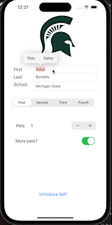

# CodePathPreWork
First App Interface created for my codepath prework!

## StudentIntroduction

### App Description

An iOS App that gives students the ability themselves. 

### App Walk-though

 

### Features

- [x] 1. App displays an image of a school's logo
- [x] 2. App has three textfields for first, last, and school names
- [x] 3. App has a segmented control that changes student year
- [x] 4. Number of pet matches label is increased/decreased by stepper
- [x] 5. Switch makes a statement about wanting more pets or not(true/false) 
- [x] 6. Introduce yourself button shows alert box with an introduciton and dismiss button
